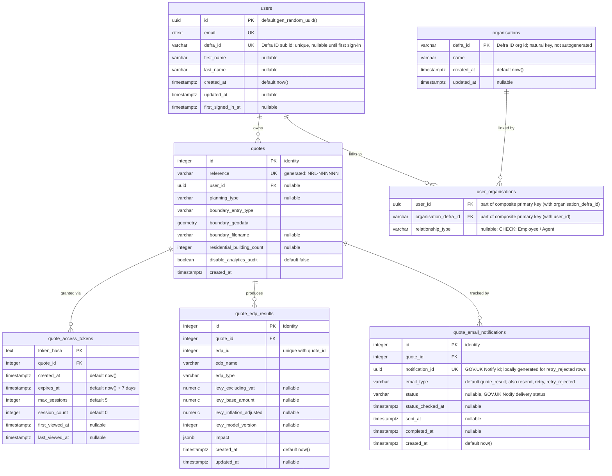

# Quote database ERD

Entity-relationship diagram of the backend **`nrf_backend`** Postgres database
(schema `public`) — the quote domain.

- **Source:** live `nrf_backend` Postgres instance (`docker compose` service `postgres`), cross-checked against the Liquibase changelog under `backend/changelog/`.
- **Generated:** 2026-09-02
- **Scope:** application domain tables only. Liquibase bookkeeping (`databasechangelog`, `databasechangeloglock`) and the PostGIS reference table (`spatial_ref_sys`) are excluded.

## Tables

| Table                       | Purpose                                                                                                                                                                   |
| --------------------------- | ------------------------------------------------------------------------------------------------------------------------------------------------------------------------- |
| `users`                     | Account holders, keyed by UUID and unique (case-insensitive) email; Defra ID profile details captured at sign-in.                                                         |
| `organisations`             | Organisations as identified by Defra ID, keyed by the (natural) `defra_id`.                                                                                               |
| `user_organisations`        | Join table linking users to organisations with a relationship type (employee / agent). Citizens have no organisation link.                                                |
| `quotes`                    | Core quote records: development boundary, type, counts, and the spatial boundary geometry. Optionally linked to a `user`.                                                 |
| `quote_access_tokens`       | Hashed access tokens granting time-limited, session-capped access to a quote.                                                                                             |
| `quote_edp_results`         | Per-EDP levy results computed for a quote (unique per `quote_id` + `edp_id`).                                                                                             |
| `quote_email_notifications` | One row per email send attempt for a quote: real GOV.UK Notify sends hold the Notify id and polled delivery status; `retry_rejected` rows record attempts Notify refused. |

## Notes

- `quotes.reference` is a generated column (`NRL-` + a hashed, zero-padded id) defined via raw SQL in the Liquibase changelog.
- `quote_access_tokens`, `quote_edp_results` and `quote_email_notifications` foreign keys to `quotes` are `ON DELETE CASCADE`.
- `user_organisations` rows cascade-delete when their parent `users.id` or `organisations.defra_id` row is deleted.
- `user_organisations.user_id + organisation_defra_id` form the composite primary key — one row per user/organisation pair. `relationship_type` is nullable and restricted by a CHECK constraint to Employee / Agent (NULL passes the check) — a Citizen never gets a row here.
- `users.defra_id` is unique but nullable — users created before signing in have no Defra ID yet (Postgres allows multiple NULLs under a unique constraint).
- `quotes.user_id` is nullable — a quote can exist without an associated user.
- `quote_email_notifications.notification_id` is unique; a quote accumulates several rows over its lifetime, distinguished by `email_type`: `quote_result` (initial send), `resend` (user-initiated), `retry` (retry worker re-send) and `retry_rejected` (a retry attempt Notify rejected at accept time — no message exists, so the id is locally generated and the status poller skips these rows; they exist so rejected attempts still consume the retry budget). `status` is null until the Notify status poller first fetches it.
- `quote_edp_results` levy columns (`levy_excluding_vat`, `levy_base_amount`, `levy_inflation_adjusted`) are `NUMERIC(12,2)`; `levy_model_version` is `INTEGER`. All four are nullable — they are populated when the impact assessor reports results.
- This is the backend quote database, not the impact-assessor DB (`nrf_impact`, schema `public`).
